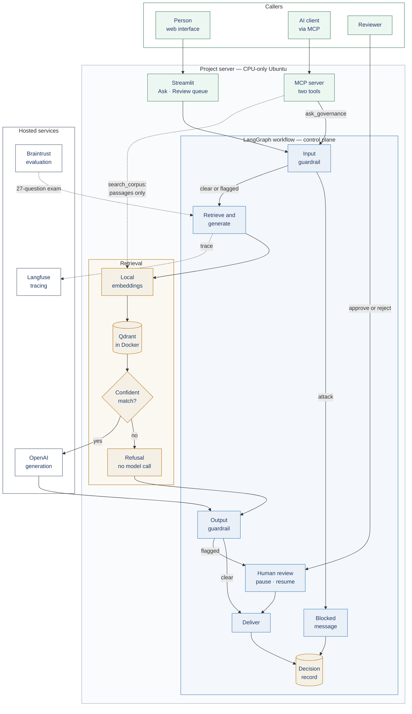

# Architecture

How the assistant is put together: the full request flow, what each component is responsible for, how retrieval-augmented generation was designed, and the decisions behind the design.

For the overview, see the [README](README.md). For the guardrails, human review and MCP in depth, see [Controls](CONTROLS.md).

---

## 1. The system in detail

**Reading the diagram**

- **Two callers, one control plane.** A person using the web interface and an AI client using MCP both enter the same LangGraph workflow. Neither has a separate route to the model.
- **One exception, shown deliberately.** The MCP search tool goes straight to retrieval and returns source passages only. It never reaches the model, but it also bypasses the input guardrail and the decision record. This is covered as a known limitation in [Controls](CONTROLS.md).
- **Two places where the model is never called.** An attack is stopped at the input guardrail, and an off-topic question is refused at the abstain floor. Neither incurs a model call.
- **Every path a question takes through the workflow ends at the decision record** — answered, refused, blocked, approved or rejected. The search tool sits outside the workflow and is not recorded.
- **Evaluation and tracing sit outside the request path.** Langfuse traces each question that reaches retrieval; Braintrust runs the test set on demand.

## 2. What happens to a question

Through the web interface, or the `ask_governance` MCP tool:

| Step | Component | What happens | If it fails |
|---|---|---|---|
| 1 | Input guardrail | Deterministic rules check the question | Prompt injection is **blocked**; a request for a legal determination about the user's own system is **flagged** and continues |
| 2 | Embedding | The question is embedded locally, with the query instruction the model was trained on | — |
| 3 | Retrieval | Qdrant returns the five most similar chunks by cosine similarity | — |
| 4 | Abstain floor | Is the best score at least 0.45? | Refused with a fixed message; **the model is not called** |
| 5 | Generation | OpenAI receives the numbered chunks and the question, with instructions to use only the sources and cite each claim | — |
| 6 | Output guardrail | Rules check the draft: invalid or missing citations, an admission that the sources only partly cover the question, retrieval just above the floor | Flagged answers go to review |
| 7 | Human review | A flagged answer pauses. A reviewer sees the draft, its sources and the reasons for the flag, then approves or rejects with a note | A rejection delivers a withheld message; the asker never sees the draft |
| 8 | Deliver and record | The response is returned and the outcome written to the decision record | — |

Every question that reaches retrieval is also traced to Langfuse: the retrieved chunks, the prompt, the answer, latency and cost. A blocked question produces no trace, but is still in the decision record.

Through the `search_corpus` MCP tool, only steps 2 to 4 run: the tool returns matching passages with their source, heading and score, and nothing else.

## 3. Component responsibilities

| Component | Responsible for | Why it exists |
|---|---|---|
| **Ingestion pipeline** | Parsing both documents into their own structure, chunking, embedding, indexing | Retrieval can only be as good as the text it searches |
| **Qdrant** (in Docker) | Storing 280 chunks with their metadata; similarity search | Self-hosted, so the corpus stays in the environment; strong metadata filtering |
| **bge-base-en-v1.5** | Turning chunks and questions into 768-dimension vectors | Runs locally on CPU: no GPU, no per-call cost, and the corpus is never sent out for indexing |
| **Abstain floor** | Refusing questions with nothing relevant in the corpus | A cheap, deterministic stop before any model call |
| **OpenAI** | Writing the answer from the supplied chunks | The one step that needs a language model |
| **LangGraph workflow** | Routing each question through the guardrails, review and record | Makes the controls part of the system's structure rather than an add-on |
| **SQLite** | Holding paused reviews and the decision record | A pending review survives a restart; every outcome is auditable |
| **Streamlit** | The asker's view and the reviewer's queue | Lets answers be checked against their sources |
| **MCP server** | Exposing two tools to MCP-compatible clients | Makes the assistant usable by other AI systems |
| **Langfuse** | A trace per question that reaches retrieval | Shows what happened inside a run after the fact |
| **Braintrust** | Scoring the test set per run, comparing runs | Shows how good the system is, and whether a change helped |

## 4. RAG design

### 4.1 Source documents

| Document | Parsed into | Notes |
|---|---|---|
| EU AI Act, consolidated text including Regulation (EU) 2026/1744 | 119 Articles | Numbered up to 113: the amendments inserted lettered Articles, such as 4a and 75c, between the originals. Amendment provenance is kept as metadata |
| NIST AI RMF 1.0 | 26 sections | Extracted from PDF |

**Why the consolidated text.** A system answering "what does the Act require?" should cite the law as it currently stands. That is also why every Article number in these documents was checked against the consolidated corpus before publication, rather than taken from the 2024 text.

**Provenance as metadata, not text.** Amendment markers in the source were stripped from the chunk text, because they carry no meaning and pollute an embedding. Which provisions were amended or deleted is kept as structured metadata instead, so it can be filtered on.

*Honest limit:* the system knows a paragraph was deleted, not what it said. Answering "what did this paragraph used to require?" would need the earlier text indexed as a second version.

### 4.2 Parsing

The two documents needed different approaches.

- **EU AI Act (HTML).** The source marks each Article heading with a stable element ID, so the parser walks the document structure rather than guessing from text. Those IDs also give each chunk a precise pointer back to the source.
- **NIST AI RMF (PDF).** A PDF describes where marks go on a page, not which text is a heading. Sections were located from the document's bookmarks, running headers were stripped by page position, and words hyphenated across line breaks were rejoined.

**Four parsing bugs were found, and none of them raised an error.** One lost 33 Articles to a structural quirk; others placed sections on the wrong page, discarded real content as duplicates, and mistook the contents page for Part 1. All were caught by counting the output and reading it.

The principle: **retrieval quality is bounded by extraction quality.** No chunking strategy or model recovers text that came out wrong.

### 4.3 Chunking

**Chunks follow the documents' own structure, not a fixed length.** An Article is a complete legal obligation; cutting it every *n* tokens would separate obligations from their conditions.

**The embedding model set a hard limit.** bge-base-en-v1.5 accepts at most 512 tokens, and the embedding library truncates anything longer silently — no error, no warning; the end of the text simply never reaches the vector. Counted with the model's own tokeniser, 42% of units — whole Articles and NIST sections — exceeded that, including the two most-queried provisions. So:

- Units over **450 tokens** are split on numbered-paragraph boundaries. The margin leaves room for the heading and special tokens.
- **Every sub-chunk carries its heading**, e.g. *"Article 14 — Human oversight"*, so a fragment stays findable and citable.
- **Overlap only where a unit was split.** Overlapping whole Articles would let one provision fill several retrieval slots with near-identical text.

| Result | |
|---|---|
| Chunks | 280 — 220 from the EU AI Act, 60 from NIST |
| Units split | 68; the most split was Article 3, the definitions (10 parts) |
| Over the model limit | 0 |
| Token range | 12 to 446, median 357 |

Chunk IDs are derived from source, unit and part, so re-running ingestion overwrites the same records rather than creating duplicates.

### 4.4 Embeddings and storage

- **bge-base-en-v1.5, run locally on CPU**, for both the corpus and incoming questions.
- **Cosine similarity on normalised vectors**, matching how the model was trained. A mismatch would still run, but would retrieve worse.
- **The query instruction is applied to questions only.** The model is trained with an instruction prefix on queries but not on documents, so the prefix is applied to questions and never to chunks.
- **Metadata indexes in Qdrant** on source, document version, unit type, Article number and deletion status, so filtered searches don't scan the whole collection.

### 4.5 Retrieval and the abstain floor

The five most similar chunks are retrieved. Before anything reaches the model, the best score is checked against a floor of **0.45**.

The floor was **measured, not guessed**. Three questions the corpus cannot answer — from easiest to hardest to detect — were run through retrieval, and their top scores compared with the score ranges from earlier test questions the corpus can answer:

| Probe | Type | Top score | Answerable? |
|---|---|---|---|
| Sourdough bread | Off-topic | 0.35 | No |
| NIST AI RMF questions | In corpus | 0.58–0.66 | Yes |
| GDPR data subject rights | Adjacent regulation | 0.62 | No |
| EU AI Act questions | In corpus | 0.70–0.78 | Yes |
| Colorado AI Act | Another AI law | 0.74 | No |

**What these probes showed.** The off-topic question scored 0.35, well below the weakest valid retrieval observed (0.58). Above that point there was no separation at all: the GDPR and Colorado questions scored like valid ones.

That is the key point of the design: **similarity measures topic, not answerability.** A score can tell a question about bread from a question about AI regulation. It cannot tell a question about Colorado's AI law from one about the EU's, because the words are nearly the same.

So the controls have two different jobs:

- **The floor** catches questions with nothing to do with the domain, cheaply and deterministically.
- **The prompt** makes the model check whether the retrieved text actually answers *this* question — including the right law and jurisdiction.

**Why 0.45 rather than 0.50.** The project deliberately prioritised not refusing valid questions. Set too low, an off-topic question reaches the model, where the prompt is designed to decline it. Set too high, a valid question is refused silently. 0.45 sits between the off-topic probe and the weakest valid score observed, with margin on both sides.

**The threshold is specific to this corpus and configuration.** A different corpus, embedding model or chunking scheme would need it measured again.

### 4.6 Grounded generation

The model receives the question and the retrieved chunks, numbered. The prompt instructs it to use only those sources, cite each claim with its number, and say plainly when the sources do not cover the question rather than filling the gap from general knowledge.

In the interface, each citation opens the exact chunk behind it, with its relevance score against the threshold, so an answer can be checked rather than trusted.

How well grounding holds is measured rather than assumed — see [Evaluation and observability](EVALUATION_AND_OBSERVABILITY.md).

### 4.7 What was learned about retrieval quality

**Case one: a question about penalties.** One test question asks about the maximum penalties under the Act. The answer sits in Article 99, on penalties, but the question's wording closely matches the title of a different Article. Four retrieval methods were tried:

| Method | Where Article 99 ranked |
|---|---|
| Semantic search (the pipeline as built) | Below 20th |
| Keyword search (BM25) | 7th |
| Hybrid, combining both | Outside the top 10 |
| Cross-encoder reranker | Outside the top 5 |

The analysis of why they all failed: the question's wording matched the title of a different Article, so each method favoured that Article, while the answer lives in an Article about penalties that shares few of the question's words. That points to a **mismatch between how the question is phrased and how the answer is written**, rather than a tuning problem, and suggested diminishing returns from further tuning of the approaches tested. The experiment was stopped by a rule agreed in advance, and none of the alternative methods went into the pipeline.

**Case two: telling people they are dealing with an AI.** During the check of Article numbers for these documents, a plainly worded question about that obligation returned only NIST sections, although Article 50 of the EU AI Act covers it directly. The same pattern: the NIST wording on human–AI interaction was the closer match to how the question was phrased.

**Retrieval improvements to evaluate for production:**

- **Query rewriting** — restate the question in the document's own terms before retrieval
- **Chunk enrichment** — a short summary on each chunk at ingestion, so a penalties Article also says what it penalises
- **Per-document retrieval** for questions that span both frameworks
- **Hybrid search and reranking inside Qdrant**, rather than added on afterwards

## 5. Architecture decisions

The decisions with the most bearing on the architecture.

| Decision | Chosen | Alternative | Why |
|---|---|---|---|
| Vector database | Qdrant, self-hosted | Pinecone | The corpus stays in the environment; metadata filtering; low overhead on one node. Pinecone would have been quicker to stand up |
| Embeddings | Local bge-base-en-v1.5 | A hosted embedding API | No per-call cost, no GPU needed, and nothing sent out for indexing |
| Source text | Consolidated EU AI Act | The 2024 text as adopted | Answers should reflect the law as it stands |
| Amendments | Provenance as metadata | Inline notes in the chunk text | Keeps embeddings clean while keeping the facts filterable |
| Chunk boundaries | Document structure, split under the model's limit | Fixed-size chunks | Keeps obligations intact; nothing silently truncated |
| Generation provider | OpenAI | An EU-resident provider | The EU provider was considered for data residency. It was not chosen because the corpus spans EU and US frameworks, so an EU-only rationale would have misdescribed the project, and because OpenAI, as the most widely used provider, was more relevant to a portfolio build |
| Abstain control | One measured floor, plus the prompt | A threshold per document | For this proof of concept, one floor was enough: it sits below the valid scores of both documents, so the difference between their score ranges does not affect it |
| Observability | Langfuse Cloud, EU region | Self-hosted Langfuse | At the time of the build, the current Python SDK required a v3 server, and self-hosted v3 stores traces in ClickHouse as part of a six-service deployment — more than the project server could host alongside everything else |
| Version pinning | Vector database client matched to the server | Upgrading the server | A client that had drifted ahead of the server was moved back: no data migration, no re-ingestion. Proven by re-running retrieval for all 27 test questions — identical results |

## 6. Known limitations

- **Single node, single user.** No redundancy, scaling or access control — see [Production readiness](PRODUCTION_READINESS.md).
- **Retrieval mismatches**, as described in section 4.7.
- **Deleted provisions** are known to be deleted, but their earlier text is not held.
- **Minor extraction artefacts.** Rejoining hyphenated line breaks in the PDF also joins a few genuine hyphens ("human-AI" becomes "humanAI"). One chunk is only 12 tokens long, most likely a heading with nothing beneath it. Both are logged and neither is material to the results.
