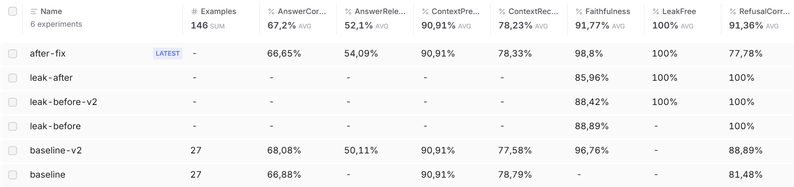

# Evaluation and observability

Two different questions, answered by two different tools:

- **Evaluation — how good is the system?** A fixed test set, scored by the applicable scorers on every run, with runs compared. Braintrust.
- **Observability — what happened inside a run?** Which chunks were retrieved, what the model was sent, how long each step took, what it cost. Langfuse.

When a question scores badly in evaluation, its trace shows whether retrieval or generation was at fault.

---

## 1. The evaluation method

**The test set.** 27 questions, written by hand: 10 on the EU AI Act, 8 on the NIST AI RMF, 3 needing both, 4 the assistant must refuse because the corpus does not cover them, and 2 adversarial — a prompt injection, which must be refused, and an instruction to answer from the model's own knowledge on a topic the corpus does cover, which must be answered from the sources. That makes 22 answerable questions and 5 to refuse. Each states its expected behaviour.

**The answer key never comes from the system under test.**

- For each answerable question, the named Article or NIST section was fetched by its heading — not by similarity search. Otherwise a retrieval mistake would be built into the "correct" answer, and the evaluation would be marking itself.
- A separate model (gpt-5.6-luna) drafted each reference answer from that text only. The model under test (gpt-5.6-terra) never wrote a reference.
- **I reviewed all 22 drafts against their sources.** Three were checked in full, and one of those failed: it described a directive in words that appear nowhere in the Act — correct in meaning, but taken from the model's own knowledge despite an instruction not to. The remaining nineteen were reviewed with a script listing every word absent from the source, and each list checked by hand.

**The scorers.** Refusal questions are scored on whether they refused. Answerable questions get the full set.

| Scorer | What it asks | Source |
|---|---|---|
| Faithfulness | Is every claim supported by the retrieved chunks? | autoevals |
| Answer relevancy | Does the answer address the question? | autoevals |
| Answer correctness | Does it match the reviewed reference? | autoevals |
| Context precision | Were the retrieved chunks relevant? | autoevals |
| Context recall | Did retrieval find what the reference needed? | autoevals |
| Refusal correct | Did it refuse exactly the questions it should? | Custom |
| LeakFree | Does a refusal state facts from outside its sources? | Custom — see section 4 |

autoevals' RAG scorers are based on the Ragas metric definitions. None of the standard metrics asks whether a question *should* have been refused, which is why that check is custom.

**Braintrust** runs the test set through the real pipeline and the scorers, and lays runs side by side question by question. Every run's results are also saved to the private implementation repository as the permanent record.

## 2. Making sure the measurement worked

**A scorer bug was caught before it produced a number.** In autoevals 0.3.0, Faithfulness extracts claims from the *reference* answer rather than the answer under test. Called as documented, it found no claims and failed. Called with a reference, it would have run and returned a plausible score for the wrong text — worse than an error. Found by reading the library source and confirmed on the library's own example; fixed with a one-line workaround.

**The noise was measured before any change was judged.** Two runs with nothing changed differed by 1.2 points on answer correctness — 13 questions up, 9 down — and the refusal verdict changed on two questions. The evaluation is model-driven end to end — the assistant and the judge are both language models — so results vary between runs, and a gain of a point or two proves nothing. A change has to beat that on the questions it targets.

## 3. Baseline results

| Scorer | Baseline | Reading |
|---|---|---|
| Refusal correct | 88.9% | 3 of 27 wrong — all over-refusals of answerable questions |
| Faithfulness | 96.8% | One refusal scored 0.60 — see section 4 |
| Context precision | 90.9% | Retrieved chunks are mostly relevant |
| Context recall | 77.6% | Retrieval sometimes misses what the answer needs |
| Answer correctness | 68.1% | Moderate agreement with the reviewed references |
| Answer relevancy | 50.1% | Not a percentage of relevant answers — see below |

**All three over-refusals traced back to retrieval, not generation.** Two asked about penalties under the Act; the answer is in Article 99, which never reached the top five — investigated in [Architecture, section 4.7](ARCHITECTURE.md#47-what-was-learned-about-retrieval-quality). The third was a question needing both documents, for which retrieval returned only NIST material.

**Answer relevancy needs reading carefully.** Its average is pulled down by six zeros. Three are refusals, where zero is fair. Three are long, substantive comparison answers that the scorer judged non-committal. Its non-zero scores are embedding similarities that rarely approach 1.0 even for good answers.

## 4. A finding corrected, and a better measure

**The baseline reported a leak that wasn't one.** A refusal about ISO/IEC 42001 scored 0.60 on faithfulness, and was recorded as the model adding outside knowledge. Before changing anything, the flagged answers were read. The ISO answer named two standards — and a search of all 280 chunks found both in the NIST executive summary, which was one of its own sources. The LeakFree judge described below, shown the same sources, also judged the full answer clean in three runs out of three. **The answer was grounded; the finding was wrong, and was withdrawn in writing.**

**Why:** faithfulness checks each claim against the sources. A correct refusal says "the sources do not cover X", and no source can support a statement about what it doesn't contain. So correct refusals lose points exactly as leaks do. **The metric cannot tell them apart.**

**So a narrower scorer was built — LeakFree.** A yes/no judge that sees the sources and asks one question: does the answer state rules, rights, requirements, lists or figures that are *not* in them? It ignores "the sources do not cover X".

**It was validated before it was trusted**, on cases with a known verdict, three times each:

| Case | Expected | Result |
|---|---|---|
| A refusal that listed GDPR rights from memory — a real leak from earlier in the build | Leak | Leak, 3 of 3 |
| A GDPR refusal that faithfulness had flagged | Clean | Clean, 3 of 3 |
| Two prompt-injection refusals that faithfulness had flagged | Clean | Clean, 3 of 3 each |
| The ISO answer from the baseline | Clean | Clean, 3 of 3 |

*Limit:* only one positive case, and an obvious one. A subtler leak — one outside fact in an otherwise clean refusal — is untested.

## 5. One change, measured

**The change.** One line in the refusal rule of the generation prompt:

| | Refusal instruction |
|---|---|
| Before | "…say so explicitly and **state what is missing**. Do not guess." |
| After | "…say so explicitly and **name what is missing in general terms only**; do not describe, list or summarise the missing content from your own knowledge. Do not guess." |

"State what is missing" invited the model to describe the missing content — the pattern behind the earlier GDPR leak.

**On the refusal questions**, five trials each:

| Scorer | Before | After |
|---|---|---|
| LeakFree | 100% | 100% |
| Refusal correct | 100% | 100% |
| Faithfulness | 88.4% | 86.0% — the false-alarm effect, not a regression |

No leak in 20 scored answers. By the rule of three, that is still consistent with a true leak rate of up to roughly 15% — an approximate upper bound, and a generous one, since the 20 answers came from repeated trials of four questions. The claim is "not seen in 20 tries", not "fixed".

**On the full test set**, as a regression check:

| Scorer | Baseline | After | Reading |
|---|---|---|---|
| Refusal correct | 88.9% | 77.8% | Investigated — see below |
| Answer correctness | 68.1% | 66.7% | Within the measured noise |
| Answer relevancy | 50.1% | 54.1% | Not targeted by the change; no noise measurement for this metric, so not interpreted |
| Context precision | 90.9% | 90.9% | Same |
| Context recall | 77.6% | 78.3% | Same |
| Faithfulness | 96.8% | 98.8% | Slightly up |
| LeakFree | — | 100% | New scorer |

**The refusal-correct drop was traced to the judge, not the assistant.** Three more answers were judged as refusals. One was a full answer that the judge, asked five more times, called a refusal three times out of five. The other two were comparison questions where retrieval returned only NIST chunks, so the assistant answered the NIST side and said the EU side was missing — the same partial answer in both runs. The baseline answers had a closing "Missing: …" line; without it, the judge read them as refusals. Their correctness scores didn't change: the content was the same, only the verdict flipped. So the *score change* came from the judge — but the partial answers underneath are a real retrieval weakness, unchanged by the fix.

**Decision: keep the change.** The diagnosis stopped there, as further work was returning little. Two side findings:

- **The fix is visible in the wording.** A baseline answer listed missing EU content from the model's own knowledge; the answers after the change did not.
- **Comparison questions retrieve lopsidedly.** "Compare the EU and NIST approaches" returned only NIST chunks. That is the per-document retrieval gap in [Production readiness](PRODUCTION_READINESS.md).

*Each row is one run. Dashes mean not scored: the refusal-only runs don't use the answer-based metrics. LeakFree is 100% on every run that has it — no leak in 44 scored answers to questions the assistant should refuse.*

## 6. Observability

**Setup.** Langfuse Cloud, EU data region. The optional AI features, which would send project data to a further service, were turned off at sign-up, so the project's trace data is configured to go to Langfuse only. Why Cloud rather than self-hosted is in [Architecture](ARCHITECTURE.md#5-architecture-decisions).

**What is traced.** The OpenAI client is wrapped so each model call is recorded with its prompt, response, tokens and cost. Retrieval is traced explicitly as well: the wrapper only sees the model call, and "what was retrieved" is the first thing to check when a RAG answer is wrong.

**The first traces were incomplete.** The retrieval step arrived; the answer and the model call did not — while the terminal showed a complete, correct answer. The cause was batching: the SDK queues trace data and sends it in the background, and a short script exited before the queue was sent. Fixed with an explicit flush; ten consecutive runs then produced complete traces. The lesson: missing trace data can look like an application bug when it is an observability one.

**What the traces showed that the output did not:**

- **The first question in a process is slow.** Retrieval took about 2.9 seconds the first time and 0.2 seconds after, because the embedding model loads once.
- **Generation time varies widely** — from 2.55 to 43.67 seconds across eight test questions.
- **In the traces measured, generation took most of the time** — on a representative trace, 2.90 seconds of retrieval against 9.19 seconds of generation. The latency evidence gave no reason to prioritise optimising the vector database.
- **Retrieval crosses documents.** A transparency question drew four EU AI Act chunks and one from NIST — the corpus behaves as one index.

**Tracing is designed to sit beside the request path, not in it.** Trace data is sent separately in the background, so an unreachable Langfuse should not stop an answer. That follows from the integration design; it was not tested by taking Langfuse offline.

**What it does not cover.** A question blocked by the input guardrail never reaches retrieval, so it produces no trace — it is in the decision record instead. Tracing each step of the LangGraph workflow was considered and declined: it needed a further library not otherwise used, and the decision record already holds each question's route and outcome.

## 7. Limitations

- **27 questions is a small test set.** Enough to find real weaknesses and compare runs; not enough for fine-grained claims.
- **The judge is a model.** Mitigated with a different model from the generator, decomposed metrics, a reviewed answer key, and rules wherever a rule suffices — but verdicts still vary between runs, as section 5 shows.
- **LeakFree has one positive validation case.**
- **No structured refusal signal.** Refusals are detected by rule where the refusal is fixed text, and by a judge where the model wrote it. A flag from the assistant itself would make this exact.
- **The evaluation service's access token could not be scoped down** on the free tier.

What production would add — evaluation as a release gate, scoring sampled live traffic, user feedback into the test set — is in [Production readiness](PRODUCTION_READINESS.md).
