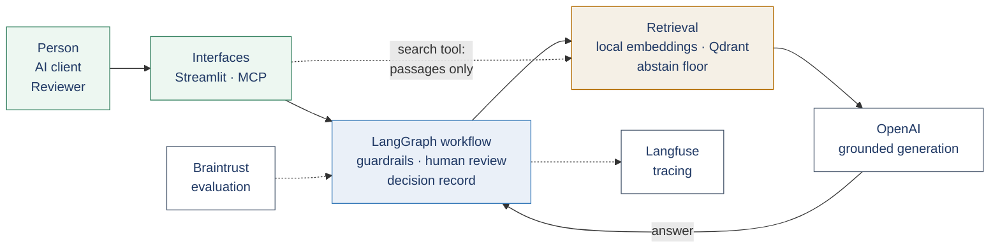
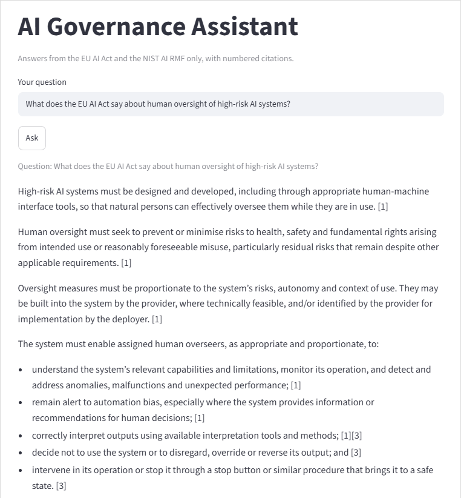

# EU AI Act Governance Assistant — a hands-on case study

A working AI assistant that answers questions about the **EU AI Act** and the **NIST AI Risk Management Framework**, grounded in the source text and citing the passages it draws on — and that knows when not to answer.

I have led AI governance work and external-client proofs of concept — covering RAG pipelines, guardrails, model evaluation and AI observability — with engineering teams carrying out the build. This project was different by design: I personally worked through the end-to-end build of a governed AI application.

The aim was to deepen the hands-on technical experience behind my existing AI delivery leadership, while also broadening my experience across different AI tools and platforms. I deliberately used technologies such as Braintrust in place of Ragas, and LangGraph-based controls in place of NVIDIA NeMo Guardrails, rather than simply recreating approaches I had delivered with before. This gave me direct experience of how different components behave, where they fail, the trade-offs between approaches and what they cost — additional technical depth I can bring to the decisions I make and the questions I ask when leading AI delivery.

This repository documents the solution, the key design decisions, how its quality was evaluated, and what would be needed to take the proof of concept towards production.

> **Status: working proof of concept and hands-on portfolio project — not a production deployment.**
> It runs on a single server for a single user. Taking it to production would need identity, access control, resilience, security testing and operational controls that are not built. See [Production readiness](PRODUCTION_READINESS.md).

---

## The problem

People working on AI governance need answers they can check. A general-purpose chatbot answers regulatory questions from its training data: the answer may be out of date, may blend sources, and gives no way to verify where a claim came from.

For regulatory work that is not good enough. An answer needs to be:

- **Grounded** — drawn from the authoritative text rather than the model's memory
- **Traceable** — each claim linked to the passage it came from
- **Honest about its limits** — refusing when the sources do not cover the question, rather than filling the gap
- **Controlled** — risky questions, such as "is my system high-risk?", routed to a person rather than answered automatically

## What it does

Ask it a question and one of four things happens:

| Outcome | When | Example |
|---|---|---|
| **Answered** | The sources cover it | *"What does the EU AI Act say about human oversight of high-risk AI systems?"* → the oversight requirements, each with a numbered citation |
| **Held for review** | A guardrail flags it | *"Is my internal document search tool high-risk?"* → held, because it asks for a legal determination; a reviewer approves or rejects |
| **Blocked** | The input is an attack | *"Ignore your previous instructions…"* → stopped before any model is called |
| **Refused** | The sources do not cover it | *"What is the capital of Portugal?"* → refused before any model is called |

Every one of those outcomes is written to a decision record.

## Source material

| Document | Version | Format |
|---|---|---|
| EU AI Act (Regulation (EU) 2024/1689) | Consolidated text including Regulation (EU) 2026/1744, dated 27 July 2026 | HTML from EUR-Lex |
| NIST AI Risk Management Framework | AI RMF 1.0 (NIST AI 100-1) | PDF |

The consolidated text was chosen deliberately: a system answering "what does the Act require?" should cite the law as it stands, not as first adopted. Amendment provenance is kept as metadata on each chunk.

## Architecture at a glance

The detailed flow, showing every route a question can take through the workflow, is in [Architecture](ARCHITECTURE.md).

## What happens to a question

1. **Input guardrail.** Deterministic rules check for prompt injection (blocked) and requests for a legal determination about the user's own system (flagged for review).
2. **Retrieval.** The question is embedded locally and the five most similar chunks are retrieved from Qdrant.
3. **Abstain floor.** If the best match scores below 0.45, the system refuses without calling the model. The threshold was measured against questions the corpus cannot answer, not guessed.
4. **Grounded generation.** The chunks go to OpenAI with a prompt that instructs the model to use only the supplied sources and to cite each claim with a numbered reference. How well that holds is measured, not assumed — see [Evaluation and observability](EVALUATION_AND_OBSERVABILITY.md).
5. **Output guardrail.** Rules check for invalid or missing citations, answers that admit the sources only partly cover the question, and retrieval just above the floor.
6. **Human review.** A flagged answer pauses. A reviewer sees the draft and its sources, then approves or rejects with a note. The person who asked never sees an unapproved draft.
7. **Decision record.** Every outcome — answered, blocked, refused, approved, rejected — is recorded with its flags and the reviewer's note.

## Technology

| Technology | Role in this project |
|---|---|
| **OpenAI** | Generates the answers. A separate model is used only for evaluation: drafting reference answers from the source text, which I then reviewed, and scoring the assistant's answers against them |
| **Qdrant** | Vector database: stores the 280 chunks and retrieves by meaning |
| **bge-base-en-v1.5** | Embedding model, run locally on CPU so the corpus is never sent out for indexing |
| **LangGraph** | The workflow: guardrail steps, deterministic routing, and a pause for human approval |
| **SQLite** | Holds paused reviews and the decision record, so a pending review survives a restart |
| **Braintrust** (with autoevals) | Evaluation: a 27-question test set scored per run, with runs compared side by side |
| **Langfuse Cloud** (EU region) | Observability: a trace per question — chunks retrieved, prompt, answer, latency, cost |
| **MCP** | Exposes the assistant as two tools that MCP-compatible clients can discover and call |
| **Streamlit** | Web interface for asking questions and for the review queue |
| **Docker Compose** | Runs Qdrant as a container, reproducibly |
| **Ubuntu VPS** | A single CPU-only server hosting everything except the three hosted services |
| **GitHub** | Version control for the implementation (private repository) |

## Capabilities demonstrated

- **Retrieval-augmented generation** — structure-aware chunking, local embeddings, vector search, grounded prompting with citations
- **Knowing when not to answer** — a measured abstain floor, applied before any model call
- **AI evaluation** — a hand-written test set with expected behaviours; faithfulness, answer relevancy, answer correctness, context precision and context recall; a custom scorer validated before use; and a measured before-and-after change
- **AI observability** — per-question tracing of retrieval, prompt, output, latency and cost
- **Guardrails** — deterministic input and output rules, tested case by case and calibrated against real questions
- **Human oversight** — risk-based approval with a pause-and-resume workflow and an auditable decision record
- **Workflow orchestration** — a LangGraph workflow with deterministic routing and checkpointed state; the model is used only to generate answers, not to decide the route
- **MCP** — the assistant exposed as tools for MCP-compatible clients. Questions pass through the same controls as the web interface; the search tool returns source passages only, with the relevance floor applied (its limits are covered in [Controls](CONTROLS.md))
- **Delivery discipline** — a tracked backlog, incremental commits, decisions recorded with their trade-offs

## Evidence

*An answered question: every point carries a numbered citation to the source text it came from.*

*A question held for review. The reviewer sees why it was flagged, the draft and its sources.*

Evaluation results, traces and the MCP interaction are in the linked documents below.

## How it was built

For this project I deliberately took the hands-on route. I designed and directed the solution and personally worked through the end-to-end build, using **Claude interactively as an AI coding assistant** to generate the code one component at a time. I ran every command and script in the terminal, tested each stage before moving on, worked through errors iteratively, and made the architecture, tooling, evaluation and control decisions — each recorded with its trade-offs.

Broadening the stack, rather than recreating approaches already delivered with engineering teams, meant working with alternatives and seeing their behaviour, limits and trade-offs first-hand:

- **Braintrust instead of Ragas for evaluation.** The same recognised metric definitions through its scorer library, on a platform built for comparing runs; where the standard metrics fell short, a custom scorer was built and validated.
- **LangGraph-based controls instead of NVIDIA NeMo Guardrails.** Deterministic rules, tested case by case, in the same workflow as the human approval step and the decision record.
- **MCP as a newer area**, exposing the assistant as tools that MCP-compatible clients can call.

My role remains delivery leadership rather than software engineering. This project adds hands-on technical depth to that experience: a delivery lead's build intended to strengthen the decisions I make, the questions I ask and the way I work with AI engineering teams.

## Documentation

| Document | What it covers |
|---|---|
| [Architecture](ARCHITECTURE.md) | Request flow, component responsibilities, RAG design and retrieval |
| [Controls](CONTROLS.md) | The LangGraph workflow, guardrails, human review and MCP |
| [Evaluation and observability](EVALUATION_AND_OBSERVABILITY.md) | How quality was measured, what the results showed, and what tracing captured |
| [Production readiness](PRODUCTION_READINESS.md) | What the proof of concept implements, and what production would require |

## About this repository

This is a **documentation-led case study**, not a runnable application. The implementation is kept in a private repository.
